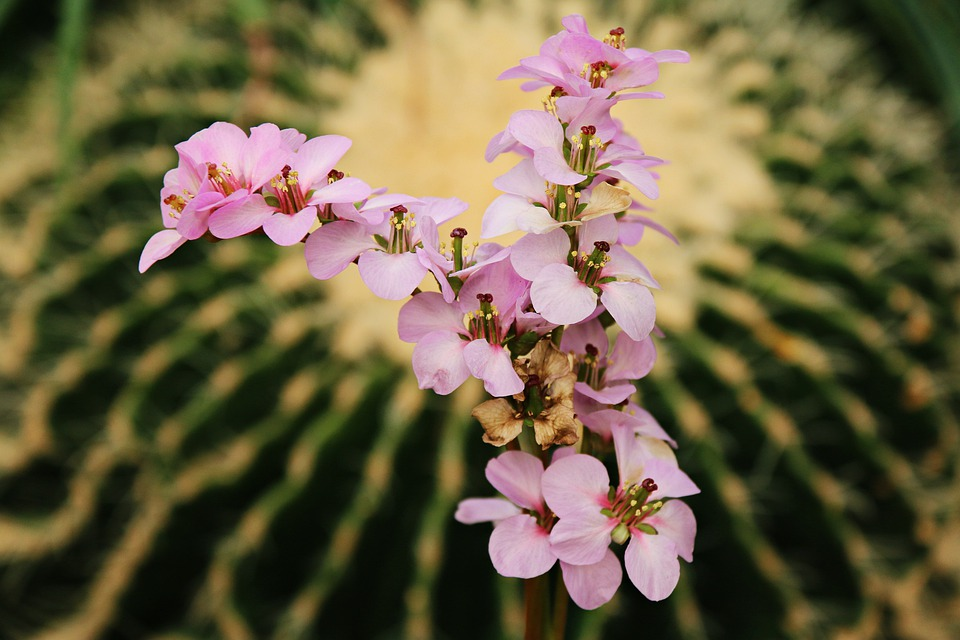

[//]: # (title:Images Gallery)
[//]: # (style:md)
[//]: # (https://pixabay.com/fr/users/happymom33-7463641/)

# Images Gallery

  <figure>
    
    
    
    
    
    
    
    
    
    
    
    
    
    
    
    
    
    
  </figure>

